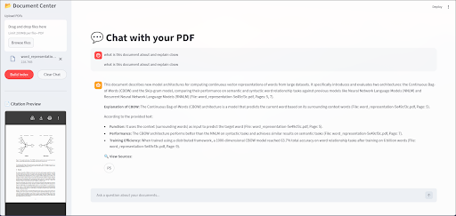

# Documind 🧠📄



Documind is an intelligent Retrieval-Augmented Generation (RAG) application that empowers users to seamlessly upload, index, and chat with their PDF documents. Built with a highly scalable FastAPI backend, Documind extracts deep insights from your files and delivers highly accurate, context-aware answers powered by Google's Gemini models, complete with reliable source citations.

## ✨ Features

* **Interactive Document Chat:** Ask complex questions about your uploaded PDFs and receive detailed, synthesized answers.
* **Intelligent Citations:** Every response includes precise file names and page numbers, ensuring you can trust and verify the information provided.
* **Inline Citation Preview:** Visually inspect the exact source document page directly within the sidebar context window.
* **Efficient Document Indexing:** Drag and drop multiple files (up to 200MB per PDF) and build an optimized vector index in seconds.
* **Robust Architecture:** Engineered with Python and FastAPI for fast, reliable handling of document parsing, embedding generation, and LLM orchestration.

## 🛠️ Tech Stack
* **Frontend** Streamlit
* **Backend:** Python, FastAPI
* **AI & Processing:** Google Gemini, RAG Pipeline
* **Database & Storage:** Supabase (PostgreSQL, Vector Database)

## 🚀 Getting Started

### Prerequisites
Make sure you have Python 3.8+ installed on your machine.

### Installation

1. **Clone the repository:**
   ```bash
   git clone [https://github.com/saturnextreme/documind.git](https://github.com/saturnextreme/documind.git)
   cd documind
   ```

2. **Create a virtual environment:**
    ```bash
    python -m venv venv
    source venv/bin/activate  # On Windows use `venv\Scripts\activate`
    ```

3. **Install dependencies:**
    ```bash
    pip install -r requirements.txt
    ```

4. **Environment Variables:**
    Create a .env file in the root directory and add your necessary API keys and database configurations:
    ```bash
    GEMINI_API_KEY=your_gemini_api_key_here
    DATABASE_URL=your_database_url_here
    SUPABASE_KEY=your_supabase_anon_key_here
    SUPABASE_URL=your_supabase_project_url_here
    ```

5. **Running the Application**
   ```bash
   chmod +x run.sh
   ./run.sh
   ```

## 📖 How to Use
* Upload: Drag and drop your PDF files into the sidebar under the "Document Center".

* Index: Click the Build Index button to process and embed your documents.

* Chat: Type your questions into the chat input at the bottom of the screen.

* Verify: Check the inline citations and click "View Sources" to see the exact page from your PDF.