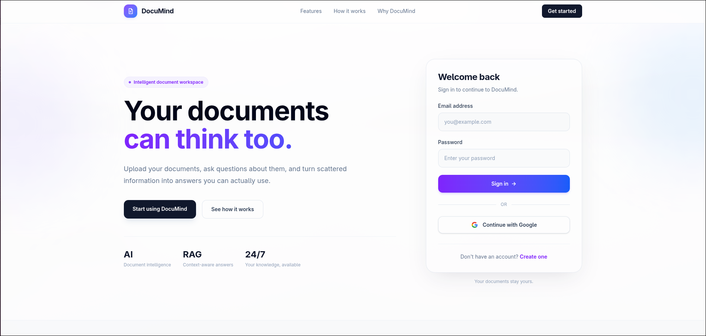
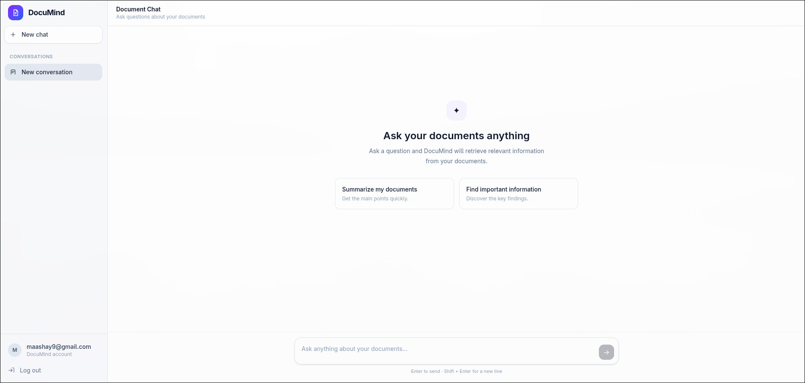
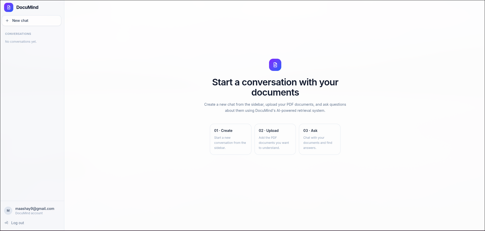

# DocuMind AI

> A production-ready multi-document RAG platform for intelligent PDF search, question answering, and source-grounded responses.

[Live Demo](https://documind-one-eta.vercel.app/login) · [GitHub Repository](https://github.com/saturnextreme/documind)

---

## Overview

DocuMind AI is a full-stack document intelligence platform that allows users to upload multiple PDF documents, build a searchable knowledge base, and ask questions using natural language.

The system processes uploaded documents into smaller text chunks, generates vector embeddings, stores them in PostgreSQL using `pgvector`, and retrieves the most relevant context for each user query. Gemini then generates an answer using the retrieved document context and provides page-level source citations.

The application also includes authentication, persistent chat history, session management, document status tracking, and cloud storage.

---

## Screenshots

### 1. Dashboard



### 2. Document Upload & Management


### 3. Document Q&A



### 4. Source-Grounded Response



---

## Features

- Multi-document PDF upload
- PDF text extraction and preprocessing
- Paragraph-aware text chunking
- Semantic vector search
- Metadata and page-level retrieval
- Retrieval-Augmented Generation (RAG)
- Source-grounded answers with document/page citations
- Persistent chat history
- Session-based document management
- Google OAuth authentication
- Document indexing status tracking
- Supabase Storage integration
- PostgreSQL + pgvector vector database
- Production error handling
- Deployed full-stack application

---

## Architecture

```text
                         ┌─────────────────────┐
                         │      React UI       │
                         │                     │
                         │ Upload PDFs / Chat  │
                         └──────────┬──────────┘
                                    │
                                    │ REST API
                                    ▼
                         ┌─────────────────────┐
                         │      FastAPI        │
                         │      Backend        │
                         └──────────┬──────────┘
                                    │
                ┌───────────────────┼───────────────────┐
                │                   │                   │
                ▼                   ▼                   ▼
        ┌──────────────┐    ┌──────────────┐    ┌──────────────┐
        │  Supabase    │    │ RAG Pipeline │    │   Gemini     │
        │              │    │              │    │              │
        │ PostgreSQL   │    │ PDF → Chunks │    │ Answer       │
        │ Storage      │    │ → Embeddings │    │ Generation   │
        │ Auth         │    │              │    │              │
        └──────┬───────┘    └──────┬───────┘    └──────────────┘
               │                   │
               │                   ▼
               │          ┌─────────────────┐
               │          │    FastEmbed    │
               │          │                 │
               │          │ Vector Embeds   │
               │          └────────┬────────┘
               │                   │
               └───────────────────▼
                         ┌─────────────────┐
                         │ PostgreSQL      │
                         │ + pgvector      │
                         │                 │
                         │ Document Chunks │
                         │ Embeddings      │
                         │ Metadata        │
                         └─────────────────┘
````

---

## RAG Pipeline

DocuMind follows a retrieval-augmented generation pipeline.

### 1. Document Upload

Users upload one or more PDF documents through the React frontend.

```text
PDF
 │
 ▼
FastAPI Upload Endpoint
 │
 ▼
Supabase Storage
 │
 ▼
Document Metadata → PostgreSQL
```

Each uploaded document is associated with a session and receives a unique document identifier.

---

### 2. Document Processing

During indexing, the backend downloads the PDFs from Supabase Storage and extracts their text page by page.

```text
PDF
 │
 ▼
PDF Reader
 │
 ▼
Page-level text
 │
 ▼
Text Splitting
 │
 ▼
Document Chunks
```

Each chunk retains metadata such as:

* Document ID
* File name
* Page number
* Chunk index
* Document metadata

This metadata is later used to generate source citations.

---

### 3. Text Chunking

The extracted document text is divided into smaller overlapping chunks.

The current pipeline uses:

```text
Chunk size: 500
Overlap:    100
```

The chunking process preserves page-level metadata so retrieved content can be traced back to its original location.

---

### 4. Embedding Generation

Each text chunk is converted into a vector representation using **FastEmbed**.

```text
Text Chunk
    │
    ▼
FastEmbed
    │
    ▼
Vector Embedding
```

These embeddings are stored in PostgreSQL using the `pgvector` extension.

---

### 5. Vector Storage

Document chunks and their embeddings are stored in PostgreSQL.

Conceptually:

```text
document_chunks
├── id
├── document_id
├── session_id
├── chunk_index
├── content
├── page_number
├── embedding
├── metadata
└── created_at
```

The vector database allows semantic similarity search rather than relying only on exact keyword matching.

---

### 6. Query Processing

When a user asks a question:

```text
User Question
      │
      ▼
FastEmbed
      │
      ▼
Question Embedding
      │
      ▼
PostgreSQL / pgvector
      │
      ▼
Top Relevant Chunks
```

The backend performs similarity search through a PostgreSQL RPC function and restricts retrieval to the current session.

---

### 7. Context Construction

The retrieved chunks are combined into a context passed to Gemini.

```text
Question
   +
Retrieved Document Chunks
   +
Document Metadata
   │
   ▼
Prompt
```

The prompt instructs the model to answer using the retrieved context and include document/page references.

---

### 8. Answer Generation

Gemini generates the final response from the retrieved context.

```text
Retrieved Context
       +
User Question
       │
       ▼
     Gemini
       │
       ▼
Grounded Answer
       +
Source Citations
```

Example citation format:

```text
(File: example.pdf, Page: 4)
```

---

## Backend API

The FastAPI backend exposes REST endpoints for managing sessions, documents, indexing, and conversations.

### Sessions

```http
POST /api/sessions
```

Creates a new document/chat session.

```http
GET /api/sessions
```

Returns the user's sessions.

```http
DELETE /api/sessions/{session_id}
```

Deletes a session and its associated data.

---

### Documents

```http
POST /api/sessions/{session_id}/documents
```

Uploads PDF documents to a session.

```http
POST /api/sessions/{session_id}/index
```

Processes uploaded documents and builds the searchable knowledge base.

---

### Chat

```http
POST /api/sessions/{session_id}/chat
```

Processes a user question through the RAG pipeline and returns the generated response.

```http
GET /api/sessions/{session_id}/chat
```

Retrieves persistent chat history for the session.

---

## Database Design

DocuMind uses PostgreSQL through Supabase.

The main data entities are:

```text
Users
  │
  ▼
Sessions
  │
  ├──────────────► Documents
  │                    │
  │                    ▼
  │             Document Chunks
  │                    │
  │                    ▼
  │              Vector Embeddings
  │
  └──────────────► Chat Messages
```

### Sessions

Stores conversation/document workspace information.

### Documents

Stores uploaded document metadata and processing status.

Example statuses include:

```text
uploaded
indexing
indexed
failed
```

### Document Chunks

Stores processed text chunks, page numbers, metadata, and vector embeddings.

### Chat Messages

Stores user questions and generated assistant responses for persistent conversation history.

---

## Authentication

Authentication is handled using **Supabase Authentication** with Google OAuth.

The application associates sessions and documents with authenticated users to prevent users from accessing another user's document sessions.

The backend validates the authenticated user before performing protected session, document, and chat operations.

---

## Technology Stack

### Frontend

* React
* JavaScript
* Tailwind CSS
* Supabase Auth

### Backend

* Python
* FastAPI
* Uvicorn
* Pydantic

### AI / RAG

* Google Gemini
* FastEmbed
* Retrieval-Augmented Generation
* pgvector

### Database & Storage

* PostgreSQL
* Supabase
* Supabase Storage

### PDF Processing

* pypdf
* Custom document loading
* Custom text chunking

### Development & Deployment

* Git
* GitHub
* Docker
* Linux
* Cloud deployment

---

## Project Structure

```text
documind/
│
├── backend/
│   ├── api/
│   ├── auth/
│   ├── rag/
│   │   ├── document_loader.py
│   │   ├── embedder.py
│   │   ├── vector_store.py
│   │   ├── generate_response.py
│   │   └── pipeline.py
│   │
│   ├── services/
│   │   ├── documents.py
│   │   ├── sessions.py
│   │   └── chat.py
│   │
│   ├── config.py
│   └── main.py
│
├── frontend/
│   ├── src/
│   └── ...
│
└── README.md
```

---

## Local Development

### Prerequisites

Make sure the following are installed:

* Python 3.10+
* Node.js
* npm
* PostgreSQL / Supabase project
* Google Gemini API key

---

### Backend Setup

Clone the repository:

```bash
git clone https://github.com/saturnextreme/documind.git
cd documind/backend
```

Create a virtual environment:

```bash
python -m venv env
```

Activate it:

### Linux / macOS

```bash
source env/bin/activate
```

### Windows

```bash
env\Scripts\activate
```

Install dependencies:

```bash
pip install -r requirements.txt
```

Create a `.env` file:

```env
GEMINI_API_KEY=your_gemini_api_key
DATABASE_URL=your_database_url
SUPABASE_URL=your_supabase_url
SUPABASE_KEY=your_supabase_key
ALLOWED_ORIGIN=http://localhost:3000
```

Start the backend:

```bash
uvicorn main:app --reload
```

The API will be available at:

```text
http://localhost:8000
```

---

### Frontend Setup

```bash
cd frontend
npm install
```

Configure the required frontend environment variables and start the development server:

```bash
npm run dev
```

---

## Application Flow

The complete user flow is:

```text
Login
  │
  ▼
Create Session
  │
  ▼
Upload PDFs
  │
  ▼
Store PDFs in Supabase Storage
  │
  ▼
Create Document Records
  │
  ▼
Index Documents
  │
  ├── Extract PDF Text
  │
  ├── Split Into Chunks
  │
  ├── Generate Embeddings
  │
  └── Store Chunks + Vectors
  │
  ▼
Ask Question
  │
  ▼
Generate Query Embedding
  │
  ▼
Vector Similarity Search
  │
  ▼
Retrieve Relevant Chunks
  │
  ▼
Build Context
  │
  ▼
Gemini
  │
  ▼
Grounded Answer + Citations
  │
  ▼
Persist Chat History
```

---

## Error Handling & Document Lifecycle

Document processing is tracked through explicit states.

```text
uploaded
    │
    ▼
indexing
    │
    ├──────────────► failed
    │
    ▼
 indexed
```

This allows the frontend to communicate the current processing state to users and prevents chat operations from running against an unavailable knowledge base.

---

## Why DocuMind?

Traditional document search often requires users to manually search through files and determine which sections contain the required information.

DocuMind combines:

* Document ingestion
* Structured preprocessing
* Semantic retrieval
* Vector search
* LLM generation
* Source attribution

to provide a single workflow for querying multiple documents using natural language.

---

## Future Improvements

Potential improvements include:

* Background document indexing
* Streaming model responses
* Improved document parsing for tables and scanned PDFs
* Hybrid keyword + vector retrieval
* Reranking retrieved chunks
* Document-level analytics
* Automated data-quality monitoring
* Larger-scale asynchronous processing

---

## Author

**Aashay Metekar**

* GitHub: https://github.com/saturnextreme
* LinkedIn: https://www.linkedin.com/in/aashay-metekar-429996223

---

## License

This project is available for educational and portfolio purposes.

```

One important thing: I deliberately **didn't put unsupported claims** like “handles millions of documents,” “production-scale distributed architecture,” or “sub-second retrieval.” Your README should be something you can confidently defend in an interview.

Also, because this is going on GitHub, I would **not include your real API keys or `.env` contents**—only the variable names as shown above.
